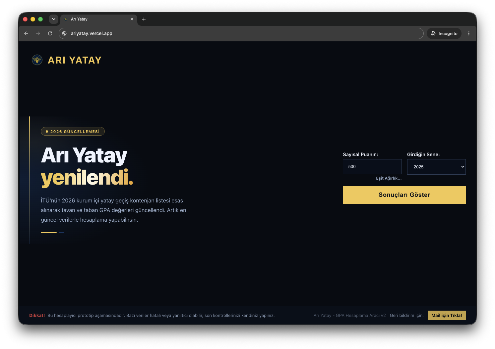

# 🐝 Arı Yatay — İTÜ Kurum İçi Yatay Geçiş GPA Hesaplayıcı

> **Resmi bir site değildir.** İTÜ ile herhangi bir bağlantısı bulunmamaktadır.

YKS puanını gir, İTÜ'deki bölümlerin tavan ve taban GPA değerleriyle anında karşılaştır.

🌐 **[ariyatay.vercel.app](https://ariyatay.vercel.app)**

---

---

## Nedir?

**Arı Yatay**, İTÜ'nün kurum içi yatay geçiş kontenjan verilerini kullanarak, öğrencilerin YKS puanlarına göre hangi bölümlere yatay geçiş yapabileceklerini görselleştiren bir araçtır.

- YKS puanını ve giriş yılını gir
- Tüm bölümlerin tavan / taban GPA değerlerini görüntüle
- Bölüme, yarıyıla veya İngilizce oranına göre filtrele

---

## 🆕 Veri Güncellemesi

İTÜ'nün **güncel kurum içi yatay geçiş kontenjan listesi** esas alınarak tavan ve taban GPA değerleri güncellendi.  
Artık en güncel verilerle hesaplama yapabilirsin.

---

## Özellikler

- [x] YKS puanına göre GPA hesaplama
- [x] Bölüm adına göre arama / filtreleme
- [x] Yarıyıla göre filtreleme (3. / 5. yarıyıl)
- [x] Yalnızca İngilizce bölüm filtresi
- [x] Tavan / taban GPA sütunlarına göre sıralama
- [x] Eşit ağırlık desteği
- [x] 2023, 2024 ve 2025 veri yılı desteği
- [x] Geri bildirim maili

---

## Sürüm

> **v2.0 — 2026 Güncellemesi**

---

## Uyarı

> Bu hesaplayıcı prototip aşamasındadır. Bazı veriler hatalı veya yanıltıcı olabilir; son kontrollerinizi kendiniz yapınız.
